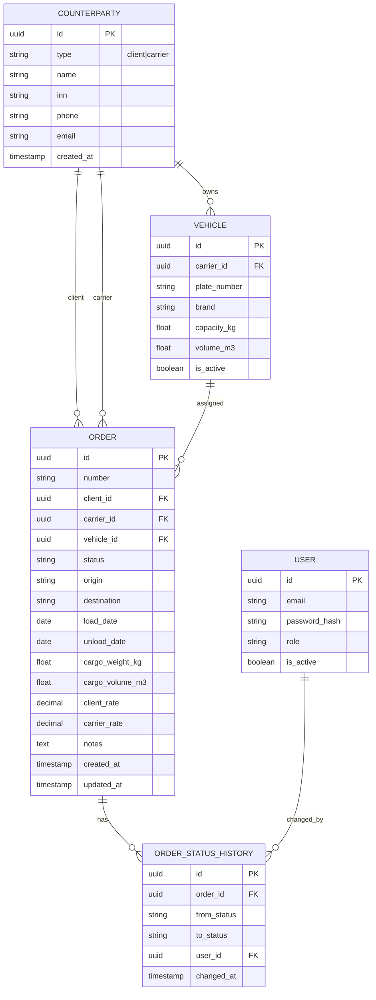

# Техническое задание — Raznaia TMS MVP

## 1. Стек технологий

| Слой | Технология | Обоснование |
|------|------------|-------------|
| Backend | Python 3.12, FastAPI | Быстрая разработка API, auto OpenAPI |
| ORM | SQLAlchemy 2.0 | Зрелая ORM, миграции |
| Migrations | Alembic | Версионирование схемы БД |
| DB | PostgreSQL 16 | Надёжность, JSON, full-text search |
| Auth | JWT (python-jose) | Stateless, просто для MVP |
| PDF | WeasyPrint + Jinja2 | HTML→PDF, гибкие шаблоны |
| Frontend | React 18, Vite, TS | Компонентный UI |
| UI | Tailwind CSS | Быстрая вёрстка таблиц/форм |
| DevOps | Docker Compose | Локальный и prod одинаково |
| Tests | pytest, httpx | API integration tests |

---

## 2. Архитектура

```
┌─────────────────────────────────────────────────────────┐
│                     Browser (React)                      │
└─────────────────────────┬───────────────────────────────┘
                          │ HTTPS / JSON
┌─────────────────────────▼───────────────────────────────┐
│                   FastAPI Application                    │
│  ┌──────────┐  ┌──────────┐  ┌──────────┐  ┌──────────┐ │
│  │ Routers  │→ │ Services │→ │   Repos  │→ │   ORM    │ │
│  └──────────┘  └──────────┘  └──────────┘  └──────────┘ │
└─────────────────────────┬───────────────────────────────┘
                          │
┌─────────────────────────▼───────────────────────────────┐
│                    PostgreSQL 16                         │
└─────────────────────────────────────────────────────────┘
```

### Структура backend

```
backend/
├── app/
│   ├── main.py              # FastAPI app
│   ├── config.py            # Settings (pydantic-settings)
│   ├── database.py          # Session, engine
│   ├── models/              # SQLAlchemy models
│   ├── schemas/             # Pydantic DTOs
│   ├── routers/             # API endpoints
│   ├── services/            # Business logic
│   └── templates/           # Jinja2 PDF templates
├── alembic/
├── tests/
├── requirements.txt
└── Dockerfile
```

---

## 3. Модель данных (ER)



---

## 4. API Endpoints (v1)

Base URL: `/api/v1`

### Auth
| Method | Path | Описание |
|--------|------|----------|
| POST | `/auth/login` | JWT token |

### Counterparties
| Method | Path | Описание |
|--------|------|----------|
| GET | `/clients` | Список клиентов |
| POST | `/clients` | Создать клиента |
| GET | `/clients/{id}` | Карточка |
| PATCH | `/clients/{id}` | Обновить |
| DELETE | `/clients/{id}` | Soft delete |
| GET | `/carriers` | Список перевозчиков |
| POST | `/carriers` | Создать |
| ... | | Аналогично clients |

### Vehicles
| Method | Path | Описание |
|--------|------|----------|
| GET | `/vehicles` | Список (?carrier_id=) |
| POST | `/vehicles` | Создать |
| GET | `/vehicles/{id}` | Карточка |
| PATCH | `/vehicles/{id}` | Обновить |

### Orders
| Method | Path | Описание |
|--------|------|----------|
| GET | `/orders` | Список + фильтры |
| POST | `/orders` | Создать |
| GET | `/orders/{id}` | Карточка + margin |
| PATCH | `/orders/{id}` | Обновить поля |
| PATCH | `/orders/{id}/status` | Сменить статус |
| GET | `/orders/{id}/application.pdf` | PDF заявка |
| DELETE | `/orders/{id}` | Soft delete |

### Reports & Dashboard
| Method | Path | Описание |
|--------|------|----------|
| GET | `/dashboard` | Счётчики, заказы на сегодня |
| GET | `/reports/orders` | Отчёт за период (JSON/CSV) |

### Query parameters (GET /orders)
- `status` — фильтр по статусу
- `client_id` — UUID клиента
- `date_from`, `date_to` — диапазон load_date
- `limit` (default 50), `offset` (default 0)
- `sort` — `load_date`, `-load_date`, `created_at`

---

## 5. Правила переходов статусов

```python
ALLOWED_TRANSITIONS = {
    "draft": ["confirmed", "cancelled"],
    "confirmed": ["assigned", "cancelled"],
    "assigned": ["in_transit", "cancelled"],
    "in_transit": ["completed", "cancelled"],
    "completed": ["closed"],
    "closed": [],
    "cancelled": [],
}
```

При смене статуса создаётся запись в `order_status_history`.

---

## 6. Нумерация заказов

Формат: `TT-{YYYY}-{NNNNN}` (например `TT-2026-00042`)

- Автоинкремент в рамках года
- Генерация в service layer при создании

---

## 7. PDF-заявка

- Шаблон: `templates/application.html`
- Данные: реквизиты клиента, маршрут, даты, груз, ставка, номер заказа
- Header: `Content-Disposition: attachment; filename="application-{number}.pdf"`

---

## 8. Безопасность (MVP)

| Требование | Реализация |
|------------|------------|
| Пароли | bcrypt hash |
| API auth | Bearer JWT, TTL 24h |
| CORS | whitelist frontend origin |
| SQL injection | SQLAlchemy parameterized |
| Secrets | `.env`, не в git |

---

## 9. Нефункциональные требования

| Метрика | MVP target |
|---------|------------|
| API response p95 | < 300 ms |
| Concurrent users | 10 |
| DB size | до 100k заказов |
| Uptime | best effort (demo) |
| Backup | pg_dump daily (prod) |
| Locale | ru-RU, RUB, timezone Europe/Moscow |

---

## 10. Переменные окружения

```env
DATABASE_URL=postgresql+asyncpg://raznaia:raznaia@db:5432/raznaia
SECRET_KEY=change-me-in-production
JWT_EXPIRE_HOURS=24
CORS_ORIGINS=http://localhost:5173
APP_ENV=development
```

---

## 11. Docker Compose services

| Service | Image | Port |
|---------|-------|------|
| db | postgres:16-alpine | 5432 |
| backend | build ./backend | 8000 |
| frontend | build ./frontend *(нед.3)* | 5173 |

---

## 12. Тестовая стратегия

```
tests/
├── test_clients.py      # CRUD clients
├── test_orders.py       # CRUD + status workflow
├── test_orders_pdf.py   # PDF generation
└── conftest.py          # fixtures, test DB
```

- Test DB: SQLite in-memory или PostgreSQL test container
- CI: `pytest -v --cov=app`

---

## 13. Milestone mapping

| Milestone | API | UI |
|-----------|-----|-----|
| M2 Alpha | Orders CRUD + status | — |
| M3 Beta | + PDF + dashboard | React pages |
| M4 v1.0 | + auth + reports | + login |
